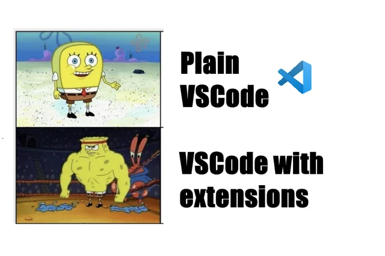

## My Reflection

  Last week was the first time I ever used VSCode. VSCode seemed scary at first with all the buttons laid out, but I gradually got used
  to it over this week. Things such as terminals, pushing git commands in said terminals, and learning the multitude of commands did seem very scary 
  at first, as if I'm starting all over again. But it's getting better day by day with more repetition. I hope to learn more about VSCode and
  better my knowledge alongside learning Git and GitHub so that I can use this program more efficiently.

  One of the tools that our professor gave us to become more efficient with our coding was the numerous extensions to 'help' us as we 
  do our programming. Two extensions stood out to me the most: ESLint and ErrorLens. These extensions are used to help detect
  errors in our coding so we know where to find a problem and debug it as intended. Seems helpful, right?

  Well for the most part, I found ESLint and ErrorLens annoying. It got really annoying whenever I was in the middle of writing code,
  and it would flag me just because I declared something without using it because, well, I literally just created the variable. It feels like I 
  don't have any room to breathe because all I see are red marks being flagged. It was so impatient with me, and I find it annoying that it just
  constantly appears when it wasn't even the finished product.

  Even though it does seem a bit tedious, I can admit that it is useful at times. Being able to point out an error while also giving an option on
  how to remove the error makes it helpful, and helps me learn more about the syntax of what I am doing. Conforming to these coding standards does
  help me understand code a bit better, and I believe that having a good sense of coding standards will help you become a better coder and 
  programmer.

  As I get more settled down with using VSCode, I will hopefully get used to ESLint and Error Lens. Despite being a nuisance at times, it can be
  very helpful. Learning these coding standards will help me in future jobs where I can write code more efficiently and easier for my colleagues
  to read and understand better. 
  
