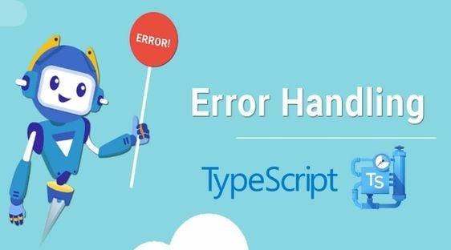

Asking good questions is actually a pretty important skill in software engineering because there are going to be a lot of times where you get stuck and need help from someone else. After reading about asking questions the “smart way,” I realized that how you ask a question can make a big difference in the kind of help you get. Instead of just saying that something does not work, it is better to explain what you are trying to do, what you have already tried, and what error you are getting. This makes it easier for other programmers to understand the problem without having to guess what is going on.

A good example of asking a smart question is the Stack Overflow post [“Typescript type casting not working”](https://stackoverflow.com/questions/34032303/typescript-type-casting-not-working). In the post, the person explains that they are new to TypeScript and that they were following an example from a TypeScript book. They show the exact example from the book, the code they tried themselves, and the compiler error that they received. They then ask whether they are doing the cast wrong or whether TypeScript had changed since the book was published. I think this is a good example because the person gives enough information for someone else to understand the issue without needing to ask a lot of extra questions. The responses were also useful because people were able to explain that int was no longer the correct type and that number should be used instead. Other answers also explained that simply casting the value was not really converting the string into a number, and suggested methods such as parseInt() instead.

A not-so-smart example is the Stack Overflow question [“Alpha number Regex”](https://stackoverflow.com/questions/12788917/alpha-number-regex). The person says that they are confused about creating a regular expression and gives the format that they want, but they do not show any code or explain what they already tried. Because of that, one of the first responses was basically asking what they had attempted. The question was also eventually closed for being too vague or incomplete. Someone did give them a regular expression that could work, but the response also told them that the problem was basic enough that they should look at a regular expression reference. Compared to the TypeScript question, there was not as much effort shown by the person asking the question, so the responses were not as helpful or detailed.

The biggest difference between these two questions is how much work the person asking the question did before asking for help. In the TypeScript example, the person had already looked at a book, tried the code, and included the exact error message. This lets other programmers focus directly on solving the problem. In the regex example, the person mostly just says what they need without showing any attempt to solve it. I can see why this matters in software engineering because if someone has to spend extra time figuring out what your actual problem is, it makes it harder for them to help you. Asking a detailed question can save time for both the person asking and the person answering.

One thing I learned from this is that when I ask programming questions in the future, I should give more information than just saying that my code is not working. I should include the part of the code that is causing the problem, the error message, what I expected to happen, and what I already tried. This is especially useful for me while learning languages like TypeScript, because sometimes I understand what I want my program to do but get stuck on the syntax or a certain method. Asking a better question would make it easier for someone else to see exactly where I am getting confused and give me a more useful answer.
