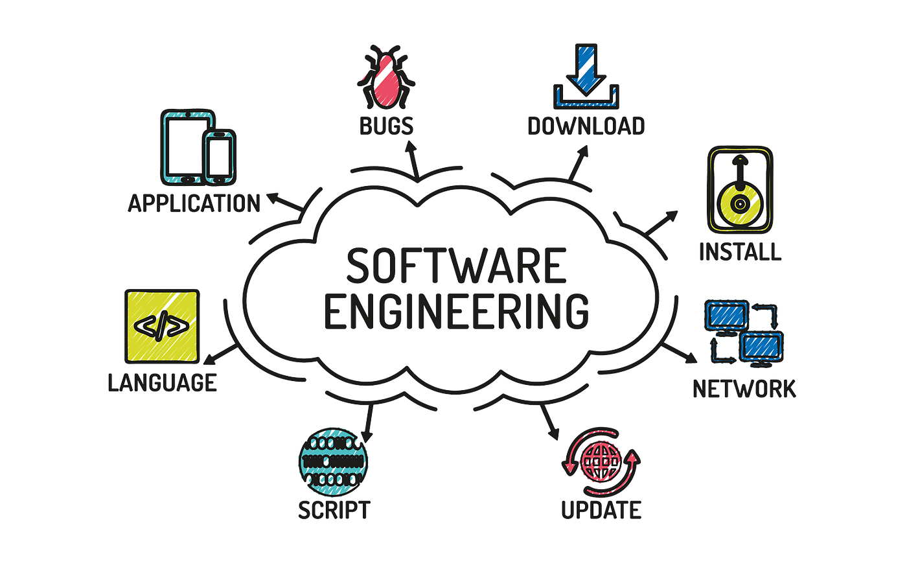

## Software Engineering? What is That?

Before taking this class, Software Engineering I, I didn't know what to expect of it. I had no prior knowledge of how software engineering worked or
what aspects about it that led me to take the class. However after a couple weeks of this class I realized the depth of material software engineering
covers and how important it is in real-world applications and how crucial it is to understand these topics as a Computer Science student.

Although I have only taken this class for about four weeks, the workload for this class has been a lot, forcing me to stay on top of my assignments
and stay focused with my learning for the class. 

