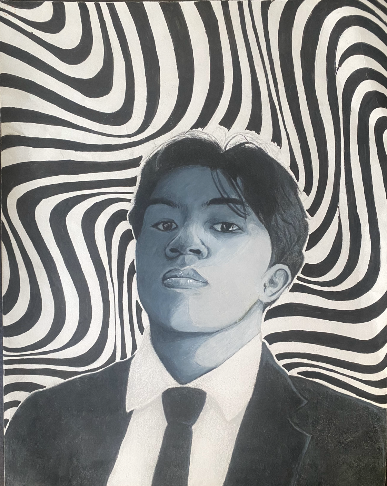
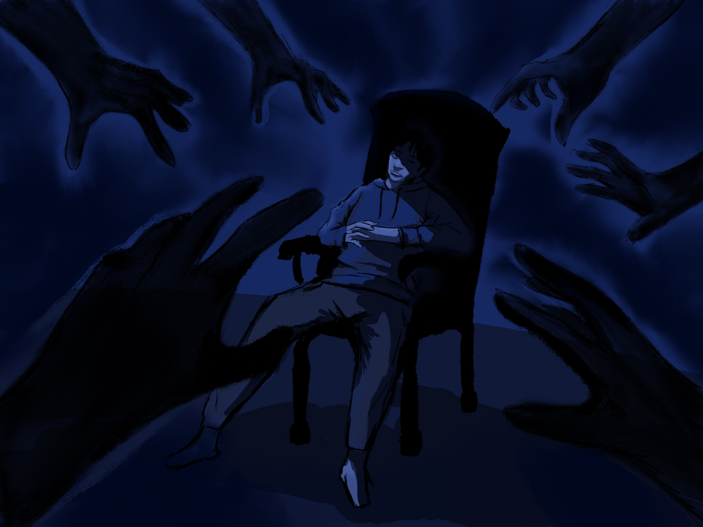
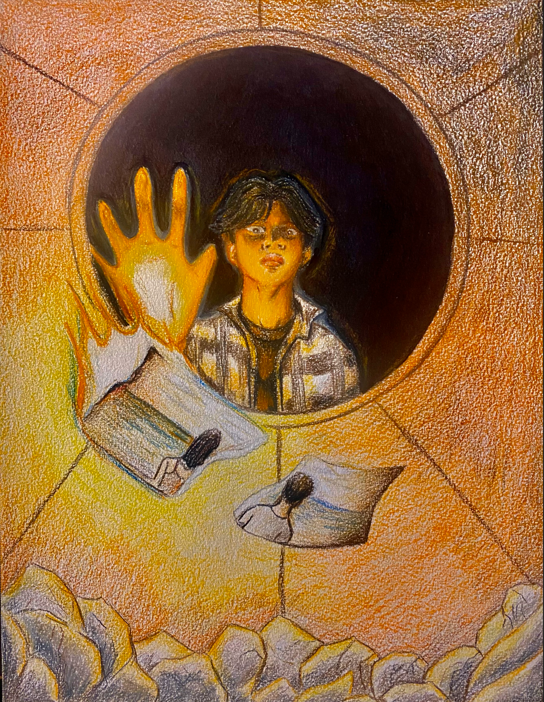

During AP Drawing class, we were instructed to create a sustained investigation of a topic of our choice, creating artwork that reflects the idea
of our chosen topic. The topic that I chose for this portfolio was “How can I portray the exploration of the stages of heartbreak through various
self-portraits?” With my investigation, I want others to visualize the journey someone like myself would go through and help people understand the  
psychological aspects of heartbreak. Therefore, most of the works shown in this section might not make sense without context.

However, for this part specifically, I will be showcasing my Selected Works of my portfolio, which best showcase my ability to demonstrate 
proficiency in art while maintaining a boundary between realism and abstraction. This portfolio comes from 2024 which was my most active year for drawing.

## Drawing 1: Disillusioned

For my first selected works is a piece I call "Disillusioned." Disillusioned refers to the 'feeling of being disappointed and unhappy because you
have learned the truth about something or someone, realizing they are not as good or special as you once believed.' I interpreted this drawing as 
being in a place that you thought you have been apart of for so long just to realize you were never meant to be here. The monotone color palette
shows that my person has lost his color, as well as the background representing reality bending away because you were never meant to exist here
in the first place that the space of time gets distorted.

## Drawing 2: Depression

For my second selected works is 

## Drawing 3: Acceptance

For my third selected works

## My Reflection

After further look into my portfolio, I realize the number of errors and mistakes on my work that need more polishment and time to work on.

