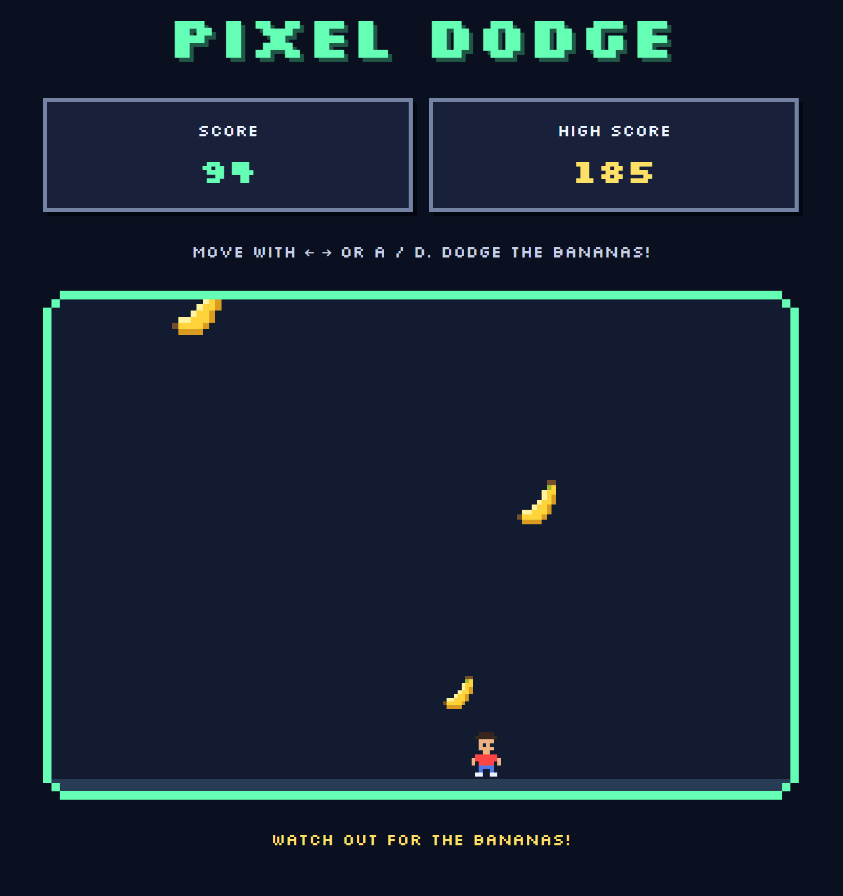

[Play Pixel Dodge](https://rockymacasio.github.io/pixel-dodge/) |
[View the source code](https://github.com/RockyMAcasio/pixel-dodge)

## About the project

Pixel Dodge is a browser game where the player moves left and right
to avoid falling bananas. The goal is to survive as long as possible.
As the round continues, the bananas fall faster and appear more often.

I wanted to create a small project that combined TypeScript logic,
interactive web design, and video game design. I chose a pixel-art
theme with a red-shirted character, banana obstacles, blocky lettering,
and stepped borders around the game screen.

## How it works

The game uses HTML Canvas to draw the character and obstacles.
A game loop updates their positions and redraws the screen.
Keyboard events track movement, and rectangular hitboxes detect
collisions between the player and the bananas.

The score increases with survival time. The game keeps a personal
high score using localStorage, so it remains available after
refreshing the page in the same browser. When the player gets hit,
the character falls sideways and the player can restart.

## Development experience

I developed Pixel Dodge with AI-assisted coding guidance and
customized its appearance and behavior through testing and iteration.
My changes included the pixel-themed interface, banana obstacles,
red character shirt, direction handling, and losing pose.

This project gave me practice working with TypeScript types,
arrays, functions, event listeners, and game state. It also introduced
me to using VS Code, running a project locally with Vite, and saving
changes with Git.

The game is hosted on GitHub Pages. A GitHub Actions workflow builds
and publishes it whenever I push changes to the main branch.

## Future improvements

I would like to add walking animations, sound effects, and touch
controls so the game can also be played on phones. I would also work on
newer levels and further twists to the games such as power-ups, and
maybe even a story-line in the future. 
